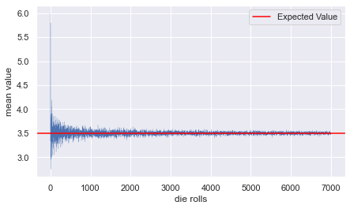

My website only consists of this one single blog post written below. All of my other write-ups and projects can be found on my GitHub profile. In the future I might expand this website to include those write-ups and projects, but as of now I think it's unnecessary work.

--- 

# Mean, Median and Mode

Most of us are familiar with the term *average*. So if I tell you that the average age of students in a statistics class at university is $19.25$ years, you know that

$$19.25 = \frac{\text{sum of the ages of all students who are in the class}}{\text{number of students in the class}}$$

More formally, we have the following definition. 

$\textbf{Definition}$ For a data set $A$ consisting of numerical values $x_1, x_2, \dots, x_n$, the **mean** or **average** of $A$ is given by

$$ \text{mean}(A) = \frac{1}{n} \sum_{i=1}^{n} x_i.$$

Mean is a single numerical value that summarizes the data set. So if somebody comes up to me and asks me about the age of students in the statistics class, instead of telling them the age of every single student in the class, it is better to just tell them the average age, which is a single numerical value that summarizes the student age data set.

Whenever we summarize any kind of information there is always going to be information loss. A summary of a movie will not contain the intricate plot details. Analogously, the mean age of students does not tell us how the age is distributed. If I tell you that the mean is $19.25$, can you tell me the age of every single student in the class? Of course not! More than one data set has the mean $19.25$

$$ \frac{18 + 21 +  20 + 18}{4}  = 19.25 = \frac{19+20+19+19}{4}$$

But you may be able to give some estimate, because you are making some implicit assumptions about the data set. You might reasonably assume that almost all the ages lie somewhere between $18$ and $25$, given the fact that this is a university class. So the implicit assumptions about *minimum*, *maximum* and *range (= maximum - minimum)* along with the mean allows you to give an estimate.

Another, perhaps less familiar, numerical summary measure is the *median*.

Briefly, the median is the *middle* value of a data set. For example, if we have the following student age data set consisting of $7$ values ordered from smallest to greatest

$$ 17, 18, 18, 18, 24, 25,30, $$

its median is $18$, the fourth value in the data set. If instead our data set had an even number of values, say the following $8$ values

$$17, 18, 18, 18, 19, 24, 25,30,$$

its median would be the average of the middle two, as there is no single middle value. So it would be $\frac{18+19}{2} = 18.5$.

More formally, we have the following definition.

$\textbf{Definition}$ Let $A$ be a data set consisting of numerical values $x_1,x_2, \dots, x_n$. We assume the following holds

$$x_{1} < x_{2} < \cdots < x_{n}.$$

If not, we can always rearrange the values so the above relations holds. The **mode** of $A$ is then given by 

- $\text{median}(A) = x_{\frac{n+1}{2}}$, if $n$ is odd. 

- $\text{median}(A) = \frac{1}{2} \big(x_{\lfloor\frac{n+1}{2} \rfloor} + x_{\lceil \frac{n+1}{2} \rceil} \big)$, if $n$ is even.

Here $\lfloor \cdot \rfloor $ and $\lceil \cdot \rceil$ are the *floor* and *ceiling* functions respectively. The floor function takes a real number $x$ as input, and outputs the greatest integer less than or equal to $x$. Similarly, the ceiling function takes $x$ as input and outputs the smallest integer greater than or equal to $x$. 

The formal definition may seem a bit abstract so let's work through the above examples again, but this time keeping the definition in mind. For

$$ 17, 18, 18, 18, 24, 25,30, $$

$n=7$, which is odd, so the median $x_{\frac{7+1}{2}} = x_4 = 18$.

For 

$$17, 18, 18, 18, 19, 24, 25,30,$$

$n=8$, which is even, so the median is 

$$\begin{aligned}
&\frac{1}{2} \big(x_{\lfloor\frac{8+1}{2} \rfloor} + x_{\lceil \frac{8+1}{2} \rceil} \big) \\
= &\frac{1}{2} \big(x_{\lfloor 4.5 \rfloor} + x_{\lceil 4.5 \rceil} \big) \\
=& \frac{1}{2} \big(x_{4} + x_{5} \big)  = \frac{1}{2} (18 + 19) = 18.5. 
\end{aligned}$$

Here $\lfloor 4.5 \rfloor = 4$ as $4$ is the greatest integer less than or equal to $4.5$. $\lceil 4.5 \rceil = 5$ as $5$ is the smallest integer greater than or equal to $4.5$. 

Notice that to calculate the median we are using at most two values in the data set and not all the values like in the calculation of the mean. Yes, the ordering does depend on the actual values in the data set, but once the data is ordered the median is not affected by the actual values to its left and right. So if we are given the following student age data sets

$$17, 18 , 30  \text{ and } 17, 18, 19,$$

both have the same median which is $18$. But one data set consists of a student whose age is $30$, which lies outside the usual $18-25$ age range for university students. Such a value is called an *outlier*. An outlier is simply a value that lies outside the normal range of values. The median is not affected by outliers as just explained. This is not true for the mean: 

$$\frac{(17+18+30)}{3} \approx 21.6 \text{ and } \frac{(17+18+19)}{3} = 18$$

Depending on our data set the median might give a better numerical summary than the mean. So if someone wants to get a rough idea about the age of students in a university statistics class, it is better to tell them the median age, instead of the mean age as it gets affected by the small number of old students or extremely young students.

 Finally, let's discuss the *mode*.  
 
 $\textbf{Definition}$ For a data set $A$ consisting of values $x_1, \dots, x_n$, the **mode** are the values that occur with the highest frequency in a data set.
 
So the mode of 

$$18,18,19,21,22$$

is $18$. But what about the data sets 

$$18,18,19,19,20 \text{ and } 18,19,20,21.$$

Does the first data set have two modes 18 and 19? And does the second have four modes or no modes at all? I admit that the definition is a bit unclear. But yes, the first data set has two modes $18$ and $19$ and the second one has no modes at all as each value occurs only once in the data set, so it doesn't make much sense to talk about the most frequent value. A data set with only one mode is called **unimodal**, and if it has more than one mode it is called **multimodal**. In particular, a multimodal data set with two modes is called **bimodal**.

The mode is also a useful numerical summary measure. If the mode age of students in a university statistics class is $18$ or $19$ or both, it tells us that this probably is a class taken by undergraduates in their first year. 

What about mean, median and mode of continuous data sets? Often we approximate a discrete data set by a continous one. For example, instead of talking about the age of universtiy students in terms of discrete values $18,19, \dots, 25$, we often make the assumption that it can take any real value between $18$ and $25$. To make sense of all this, it is better to first reframe this discussion in terms of random variables. In the following section, I will not write detailed explanations as it is intended for people who already have some familiarity with these notions.

**Mean, Median and Mode of Random Variables** 

Sometimes when taking the mean we want to give more importance to certain values in the data set than others. For example, if students in a statistics class have to take two exams, one during the middle of the semester and a second final exam at the end, the instructor might want to assign twice as much importance to the final exam score when calculating the mean score. This means if a students scores $50$/$100$ on the first exam and $70$/$100$ on the second, their *weighted mean* score would be

$$ \frac{50 + 70 \times 2}{3} \approx 63.3$$

$\textbf{Definition}$ Given a data set $A$ consisting of numerical values $x_1, \dots,x_n$ and given their corresponding weights $w_1, \dots, w_n$, the **weighted mean** is given by

$$ \text{Mean}(A)_w = \frac{\sum_{i=1}^{n} w_i x_i}{\sum_{i=1}^{n} w_i}.$$

The definition of mean of a random variable is inspired by the definition of weighted mean, with the weights given by probabilities.

$\textbf{Definition}$ Let $X$ be a random variable with a finite number of distinct possible values $x_1, \dots, x_n$ occurring with probabilities $p_1 , \dots, p_n$, respectively. The **mean** (usually called **expected value**) of $X$ is given by 

$$E[X] = \sum_{i=1}^{n} x_i p_i.$$

For example, let $X$ be the result of rolling a fair six-sided die, so $X$ takes on the values $1,2,3,4,5,$ and $6$, with equal probability $\frac{1}{6}$. The mean of $X$ is 

$$E[X] = 1 \cdot \frac{1}{6} + 2 \cdot \frac{1}{6} + \cdots + 6 \cdot \frac{1}{6} = 3.5. $$

How should we interpret this value? This obviously is not the value we expect to observe, as $X$ never equals $3.5$. It is best to interpret this value as a long-term mean. That is, if we conduct an experiment where we roll the die $6000$ times we expect to see $1000$ ones, a $1000$ twos and so on, so the mean would be

$$\frac{(1000 \times 1) + \cdots + (1000 \times 6) }{6000} = 3.5$$

It is unlikely that in our experiment of die rolls, we observe exactly $1000$ of each value, but the longer we run the experiment, the closer the experimental mean will get to $3.5$, as illustrated in the plot below. This mathematical fact is known as the [strong law of large numbers](https://en.wikipedia.org/wiki/Law_of_large_numbers#Strong_law), which I will not discuss here.

Let us now turn our attention towards continuous random variables.

$\textbf{Definition}$ Let $X$ be a continuous random variable with probability density function $f$, then its **mean** (usually called **expected value**) is given by

$$E[X] =  \int_{-\infty}^{\infty} xf(x)dx.$$

This definition is not exactly precise. We have not specified what type of integral we are talking about. We will ignore subtle issues regarding the differences between different types of integrals, namely Lebesgue and Riemann integrals. For our purposes they are the same. We can ignore pathological behaviour because the probability density function is assumed to be nice enough (bounded and continuous). So $E[X]$ is considered to be the following improper integral 

$$ \lim_{ \ \ \  \ a,b \to \infty} \int_{a}^{b} x f(x) dx,$$

where $\int_{a}^{b} x f(x) dx$ is be interpreted as a Riemann integral. Now let us try to understand the meaning of this definite integral.

Recall by definition the Riemann integral is the following limit

$$ \int_{a}^{b} x f(x) dx = \lim_{ \|\Delta x\|\rightarrow 0} \sum_{i=1}^{n} x_i^* f(x_i^*) \,\Delta x_i,$$

where 

$$a = x_0 < x_1 < x_2 \cdots < x_n =b$$

is a partition of $\[a,b\]$, $x_i^{\star}$ is any value in $x_{i-1},x_i \]$, and by $\|\Delta x\|\rightarrow 0$ we mean that the size of the intervals $\[x_{i-1},x_i \]$ shrinks to zero, so $n$ goes to infinity. Since $f$ is the probability density function, $f(x_i^{\star}) \,\Delta x_i$ is roughly the probability of the random variable $X$ taking a value inside the interval $\[x_{i-1},x_i \]$. So for small enough intervals this sum is just the weighted mean, just like in the discrete case.
